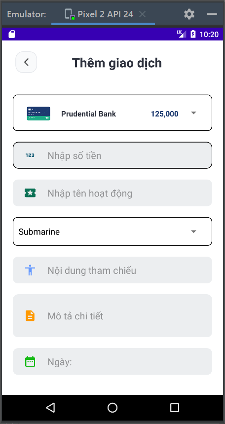
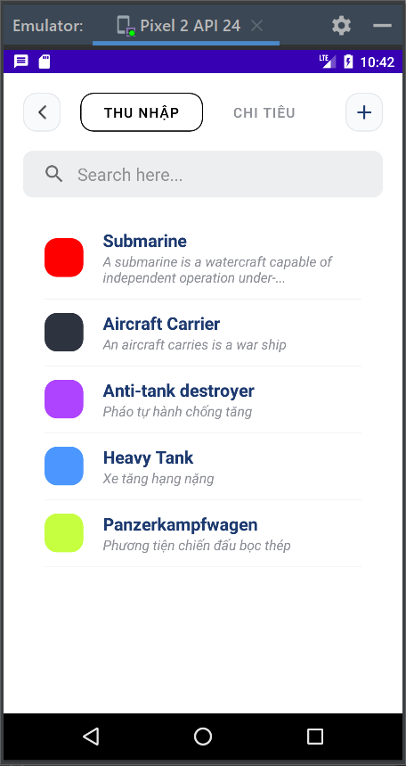

<h1 align="center">Phát Triển Ứng Dụng Di Động 
    Đề tài: Ứng dụng quản lý tài chính cá nhân
</h1>

    

# [**Table Of Content**](#table-of-content)
- [**Table Of Content**](#table-of-content)
- [**Introduction**](#introduction)
- [**Architecture**](#architecture)
- [**Folders**](#folders)
  - [**API**](#api)
  - [**Adapter**](#adapter)
  - [**Fragment**](#fragment)
  - [**View Model**](#view-model)
  - [**Model**](#model)
  - [**Container Model & Container**](#container-model--container)
  - [**Recycle View Adapter**](#recycle-view-adapter)
  - [**Helper**](#helper)
  - [**Activities**](#activities)
  - [**Home Activity**](#home-activity)
  - [**Introduce Activity**](#introduce-activity)
  - [**Main Activity**](#main-activity)
- [**Video**](#video)
- [**Features**](#features)
  - [**Home**](#home)
  - [**Transaction**](#transaction)
  - [**Card**](#card)
  - [**Category**](#category)
  - [**Goal**](#goal)
  - [**Notification**](#notification)
  - [**Dark Mode**](#dark-mode)
- [**Post Script**](#post-script)
- [**Timeline**](#timeline)
  - [**Phase 1: 28-04-2022 to 03-05-2022**](#phase-1-28-04-2022-to-03-05-2022)
  - [**Phase 2: 03-05-2022 to 10-05-2022**](#phase-2-03-05-2022-to-10-05-2022)
  - [**Phase 3: 10-05-2022 to 15-05-2022**](#phase-3-10-05-2022-to-15-05-2022)
- [**Tools**](#tools)
- [**Our Team**](#our-team)
- [**Made with 💘 and JAVA **](#made-with--and-java-)

# [**Introduction**](#introduction)

Đây là đồ án cuối kì của môn Phát Triển Ứng Dụng Di Động do thầy Trường Bá Thái giảng dạy. Đồng thời là ứng dụng cho thiết bị di động, phục vụ môn 
học [Phát Triển Phần Mềm Hướng Dịch Vụ](#) do thầy Huỳnh Trung Trụ giảng dạy.

Ngoài ra, đây là đồ án cuối cùng mà chúng mình làm với vai trò là sinh viên theo học tại Học viện Công nghệ Bưu Chính viễn thông này.

# [**Architecture**](#architecture)

Đồ án này được phát triển theo mô hình nổi tiếng là `Model - View - View Model`.

# [**Folders**](#folders)

Có rất nhiều folder trong dự án này, chúng như hình ảnh dưới dây

    

<h3 align="center">

***Cây thư mục chính của dự án***
</h3>

Mỗi thư mục sẽ đảm nhiệm một vai trò khác nhau! Để dễ theo dõi, tài liệu này sẽ giải thích theo các tập hợp Folder có liên quan tới nhau thay vì
giải thích theo trình tự từ trên xuống

## [**API**](#api)

Dự án này sử dụng thư viện [**Retrofit 2**](https://square.github.io/retrofit/) để khởi tạo kết nối tới API. Trong thư mục này có 2 tệp tin chính

- **HTTP Request** là một interface định nghĩa các yêu cầu gửi tới Server 

- **HTTP Service** là một class để khởi tạo kết nối tới API

## [**Adapter**](#adapter)

- Thư mục **Adapter** là nơi chứa các class được sử dụng để in nội dung ra màn hình ứng dụng thông qua `ListView`. Thư mục này hiện có 4 class có mục đích giống nhau là liệt kê các đối tượng danh sách. Chúng có thể phục vụ cho các Spinner hoặc cho các Activity khác. 

## [**Fragment**](#fragment)

Thư mục Fragment, như tên gọi là nơi chứa các Fragment - là màn hình con của HomeActivity. Mỗi Fragment này thể hiện 1 màn hình chức năng chủ chốt của ứng dụng. Tuy nhiên, mỗi 
Fragment này sẽ có các Activity khác đi kèm theo tên của chúng được đặt trong thư mục [**Activities**](#activities)

Giả sử, trong thư mục này có Card Fragment( đại diện cho chức năng tạo thẻ ATM ) thì sẽ có thư mục **Card** chức các Activity liên quan.
Điều này tương tự nếu thư mục có Setting Fragment thì cũng sẽ có thư mục **Setting** chứa các Activity tương ứng.

## [**View Model**](#view-model)

Thư mục **View Model** chứa các view model theo chuẩn mô hình `Model-View-ViewModel` như đã đề cập bên trên

## [**Model**](#model)

Thư mục **Model** cũng chứa các view model theo chuẩn mô hình `Model-View-ViewModel` như đã đề cập bên trên

Mỗi đối tượng trong thư mục **Model** sẽ mô tả một bảng trong cơ sở dữ liệu của API.

Ngoài ra, có 2 class đặc biệt là GlobalVariable và Summary. 

- GlobalVariable là class sẽ được sử dụng để khai báo biến toàn cục trong dự án này. Ví dụ khi đăng nhập chúng ta sẽ cần lưu lại `Access Token` 
để định danh cho HEADER khi muốn gửi một [**HTTP Request**](#api)

- Summary là class ngoại lệ bắt buộc phải được tạo bởi trong JSON trả về có sự hiện diện của một đối tượng tên summary có thuộc tính total_account

    

<h3 align="center">

***Do dữ liệu JSON trả về nên chúng ta cần một class Summary 😋***
</h3>

## [**Container Model & Container**](#container-model--container)

Thư mục Container Model là nơi sẽ định nghĩa một class đặc biệt để mapping với dữ liệu JSON trả về như dưới đây: 

    {
        "result": 1,
        "draw": 1,
        "summary": {
            "total_count": 5
        },
        "search": "",
        "data": [
            {
                "amount": 14000,
                "description": "France medium tank",
                "name": "AMX CDC Liberty",
                "reference": "France",
                "transactiondate": "2022-05-02",
                "id": 47,
                "type": 1,
                "account": {
                    "id": 1,
                    "name": "BIDV",
                    "balance": 20000,
                    "accountnumber": "3123123",
                    "description": "Tài khoản ngân hàng BIDV"
                },
                "category": {
                    "id": 1,
                    "name": "Panzerkampfwagen",
                    "type": 1,
                    "color": "#C5FF3F",
                    "description": "Phương tiện chiến đấu bọc thép"
                }
            }
    }

Như ví dụ trên đây, trường dữ liệu data có bản chất là một mảng. Với một phần từ bao gồm các trường giá trị phức hợp. Do đó chúng ta sẽ cần một class đặc biệt để mapping đúng trường giá trị được trả về như ví dự dưới đây:

    public class TransactionDetail {
    @SerializedName("amount")
    @Expose
    private Integer amount;

    @SerializedName("description")
    @Expose
    private String description;

    @SerializedName("name")
    @Expose
    private String name;

    @SerializedName("reference")
    @Expose
    private String reference;

    @SerializedName("transactiondate")
    @Expose
    private String transactiondate;

    @SerializedName("id")
    @Expose
    private Integer id;

    @SerializedName("type")
    @Expose
    private Integer type;

    @SerializedName("account")
    @Expose
    private Account account;

    @SerializedName("category")
    @Expose
    private Category category;

Thư mục **Containter** về bản chất cũng là một thư mục chức các class để mapping dữ liệu trả về giống **Containter Model**. 
Điểm khác biệt lớn nhất nằm ở chỗ, các class trong **Containter** sẽ là kiểu dữ liệu trả về trong các [**HTTP Request**](#api)

    

<h3 align="center">

***Kiểu dữ liệu trả về là class Login - class được định nghĩa trong thư mục Container***
</h3>

## [**Recycle View Adapter**](#recycle-view-adapter)

Như tiêu đề, đây là thư mục chưa khai báo của các Adapter dùng cho việc in các dữ liệu dạng danh sách ra màn hình. Về bản chất, **Recycle View Adapter** hoạt động tương tự như ListView 
nhưng có hiệu suất và tiết kiệm bộ nhớ hơn khi so với ListView😎😎

    

<h3 align="center">

***Thư mục Recycle View Adapter***
</h3>

## [**Helper**](#helper)

Thư mục **Helper** chứa các hàm dùng cho việc thay đổi cách mà dữ liệu hiển thị. Ví dụ, chúng ta muốn viết con số 123456 thành dạng 123.456 thì hàm thực thi công việc này sẽ nằm trong thư mục Helper này.

Ngoài ra, thư mục **Helper** cũng chứa các class để hiển thị ra các Alert, thông báo trên thanh quick-setting của thiết bị, modal bottot sheet, ....v.v 

    

<h3 align="center">

***Các class phụ trợ nằm trong thư mục Helper bao gồm: Alert, Modal Bottom Sheet, Notification, ....***
</h3>

## [**Activities**](#activity)

Thư mục **Activities** là nơi chứa toàn bộ các activity liên quan tới các [**Fragment**](#fragment) đã nêu ở trên. Mọi activity sẽ đảm nhiệm một chức năng hiển thị nội dung cho người dùng. 
Tất cả các activities ở đây đều có gắn bó chặt chẽ tới 5 fragment chính của đồ án.

## [**Home Activity**](#home-activity)

Đây là activity quan trọng, đóng vai trò là màn hình chính của ứng dụng. Từ home activity ta có thể truy cập tới bất kì chức năng khác nếu muốn. Activity này là nơi quản lý và sử dụng các Fragment

## [**Introduce Activity**](#introduce-activity)

Đây là nơi hiển thị các màn hình giới thiệu nếu đây là lần đầu tiên người dùng mở ứng dụng lên

    
    
    

<h3 align="center">

***Màn hình giới thiệu ứng dụng***
</h3>

## [**Main Activity**](#main-activity)

Bản chất là màn hình đăng nhập. Nếu người dùng lần đầu mở ứng dụng thì sẽ đi qua **Introduce Activity** trước rồi mới tới màn hình Đăng nhập.
Ngược lại, nếu đã đăng nhập tài khoản thì khi mở ứng dụng sẽ vào ngay màn hình Home Activity.

    

<h3 align="center">

***Màn hình đăng nhập ứng dụng. Hỗ trợ 3 hình thức đăng nhập khác nhau***
</h3>

# [**Video**](#video)

    

<h3 align="center">

***Video***
</h3>

# [**Features**](#features)

## [**Home**](#home)

    
    
    
    
    

<h3 align="center">

***Màn hình chính và các chức năng chủ chốt***
</h3>

## [**Transaction**](#transaction)

Quản lý các nguồn thu nhập/hoạt động chi tiêu và tạo sao kê với nhiều tùy chọn khác nhau

    
    
    

<h3 align="center">

***Chức năng quản lý các hoạt động thu nhập/chi tiêu***
</h3>

    
    
    

<h3 align="center">

***Thêm mới hoặc chỉnh sửa nội dung dễ dàng***
</h3>

    
    

<h3 align="center">

***Tạo sao kê với nhiều tùy chọn lọc dữ liệu📃***
</h3>

    

<h3 align="center">

***Sao kê với các thông tin theo chuẩn Ngân hàng Trung ương Việt Nam🏦***
</h3>

## [**Card**](#card)

    
    
    
    

<h3 align="center">

***Tạo thẻ ngân hàng và kiểm soát số dư tài khoản 💳***
</h3>

## [**Category**](#category)

    
    
    
    

<h3 align="center">

***Tạo các thể loại thu nhập/chi tiêu theo mong muốn***
</h3>

## [**Goal**](#goal)

    
    
    

<h3 align="center">

***Chức năng này giúp bạn đặt ra các mục tiêu để và kiểm soát việc tiết kiệm tiền bạc***
</h3>

    
    
    

<h3 align="center">

***Để dành thêm được một khoản tiền ?? Cập nhật ngay thôi😋😊***
</h3>

## [**Notification**](#notification)

    

<h3 align="center">

***Hiển thị thông báo ngay trên thanh quick-setting của thiết bị😎😋***
</h3>

## [**Dark Mode**](#dark-mode)

Bản thân Phong cũng là một tín đồ của chế độ ban đêm nên dĩ nhiên đồ án cũng không thể thiếu được chức năng vô cùng quan trọng và thiết thực này.

    
    
    
    

<h3 align="center">

***Hỗ trợ mạnh mẽ và toàn diện chế độ ban đêm🌕🌔🌓🌒🌑***
</h3>

# [**Post Script**](#post-script)

# [**Timeline**](#timeline)

## [**Phase 1: 28-04-2022 to 03-05-2022**](#phase-1-28-04-2022-to-xx-xx-2022)

- Dựng cấu trúc thư mục dự án theo chuẩn MVVM

- Thiết lập kết nối tới RESTful API qua thư viện Retrofit 2

- Dựng màn hình chính

## [**Phase 2: 03-05-2022 to 10-05-2022**](#phase-2-03-05-2022-to-10-05-2022)

- Tạo thanh điều hướng bằng BottomAppBar kết hợp BottomNavigationView

- Thêm màn hình tạo thẻ ATM

- Kéo từ phải qua trái sẽ xóa thẻ ATM

- Hiển thị thông báo mỗi khi đăng nhập ở thanh quick view của thiết bị di động

- Cử chỉ vuốt trái | phải để xóa trong danh sách 

- Chế độ ban đêm

- Tạo mới bằng nút tắt thông minh

- Thêm menu tùy chọn đến các chức năng

## [**Phase 3: 10-05-2022 to 15-05-2022**](#phase-3-10-05-2022-to-16-05-2022)

- Sử dụng Modal Bottom Sheet thay các Activity lựa chọn

- Tối ưu hóa trải nghiệm người dùng

- Tinh chỉnh lại cách các Live Data được làm mới 

- Chức năng tạo kê

- Hỗ trợ đăng nhập bằng Google & Facebook

- Sử dụng Extending Floating Button để tạo menu dạng bong bóng

# [**Tools**](#tools)

Đồ án được xây dựng trên [**Android Studio Bumble | 2021.1.1 Patch 3**](https://developer.android.com/studio) hoặc mới hơn.

Emulator - máy ảo giả lập thiết bị tối thiếu Pixel 2 API 24 hoặc mới hơn.

# [**Our Team**](#our-team)

<table>
        <tr>
            <td align="center">
                <a href="https://github.com/Phong-Kaster">
                    
                     
                    <b>Nguyễn Thành Phong</b>
                </a>
            </td>
            <td align="center">
                <a href="#">
                    
                     
                    <b>Nguyễn Đăng Hậu</b>
                </a>
            </td>
            <td align="center">
                <a href="#">
                    
                     
                    <b>Lương Đình Khang</b>
                </a>
            </td>
            <td align="center">
                <a href="#">
                    
                     
                    <b>Hoàng Đức Thuận</b>
                </a>
            </td>
            <td align="center">
                <a href="#">
                    
                     
                    <b>Nguyễn Văn Chung</b>
                </a>
            </td>
        </tr>
</table>
 
# [**Made with 💘 and JAVA **](#made-with-love-and-php)